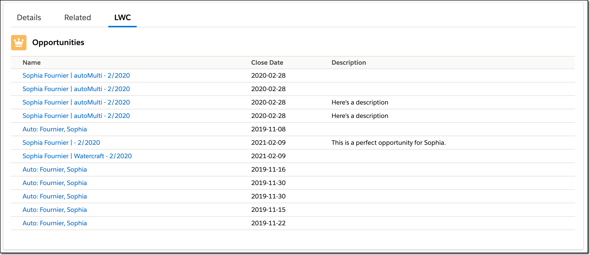
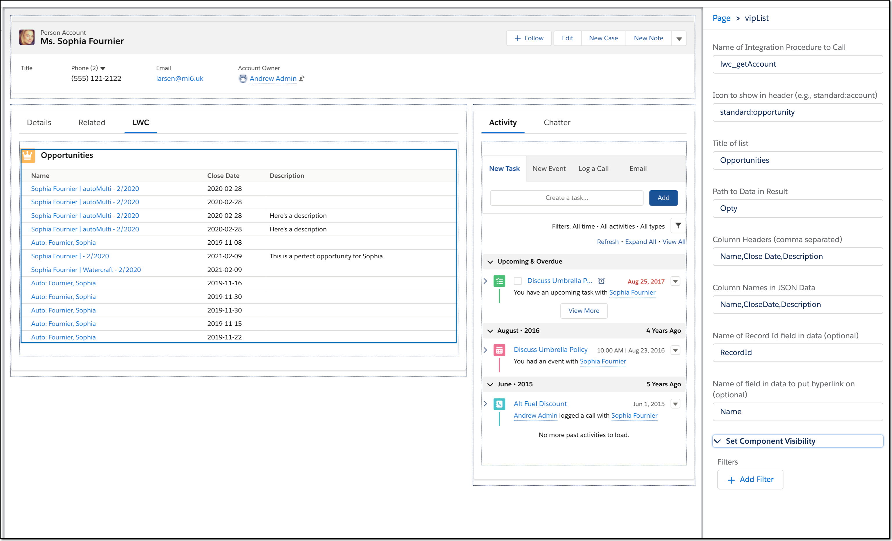

# vipList

Display the results of calling a Vlocity Integration Procedure in a table.

## Design Overview

There are two aspects to this example:

1. A LWC that gets a recordId from the environment and calls a Vlocity Integration Procedure (VIP)
2. A custom Apex class that proxies the call from the LWC

### LWC Design Overview

The LWC has a set of properties (and, for the moment, some extra useless ones) that serve as the configuration for the LWC.  These properties are shown when you bring the LWC into the app builder:

The properties are:

* Name of Integration Procedure to Call: This is in the format *type_subtype*.  The integration procedure will be passed a single input, recordId, which is the record Id driving the page as a whole.
* Icon to show in header: A salesforce  icon such as standard:opportunity that is displayed in the header.
* Title of list: What to display in the header
* Path to Data in Result: The expectation is that the data will come back as an array, but that there will be a top level identifier that is needed to traverse the data to the array.  See the examples below for a better understanding of how this works.
* Column Headers: A comma separated list of the headers for the columns to show in the table
* Colum Names in JSON data: where to find the data for the columns.  Note that only the specified columns are shown, so you can ignore spurious data that is returned.
* Name of Record Id field: If you want to allow hyperlinking to a record page, this is the name of the item in the JSON that holds the record id.
* Name fo field in data to put hyperlink on: What column should be used for the link

The link is optional, of course.

### Apex Class Design Overview

Because Vlocity's class that supports calling VIPs is not structured for directly calling from LWCs, a small proxy class was written to bridge the gap.

## Design Details

TBD

